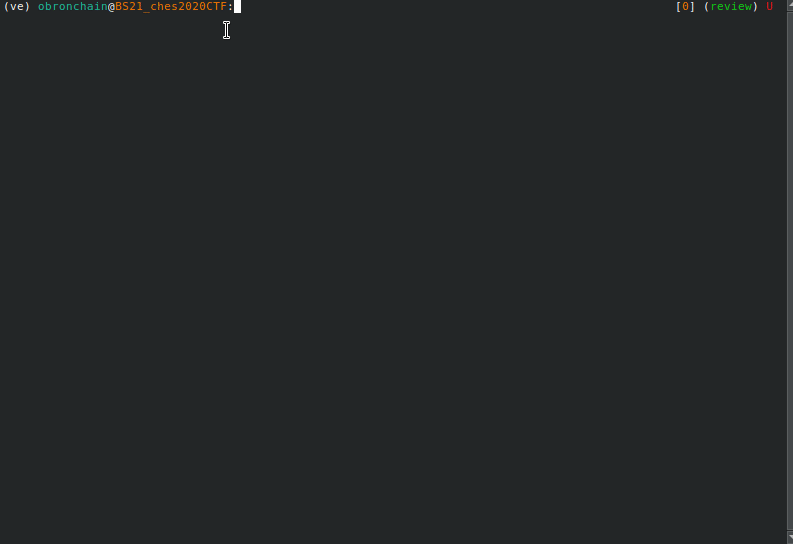
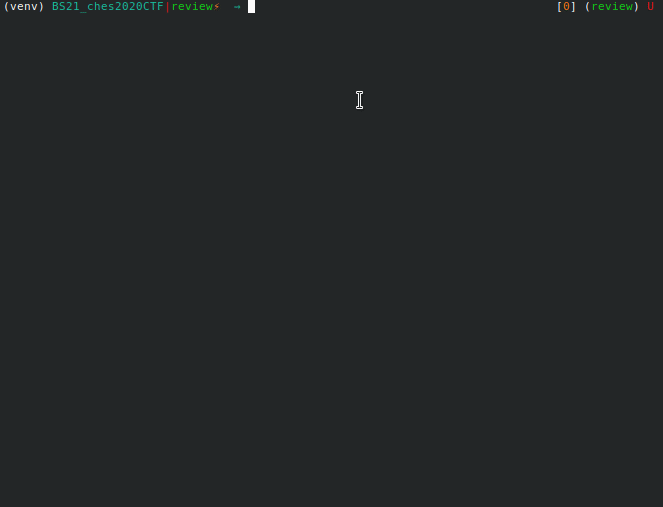
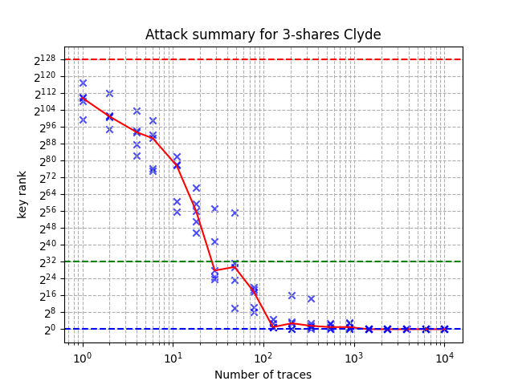

BS20 CHES2020 CTF Attack
========================

This repository contains the attack by `Bronchain and Standaert` against the
`CHES2020 CTF <https://ctf.spook.dev/>`_ software targets. It leverages `Soft Analytical Side-Channel
Attacks <https://eprint.iacr.org/2014/410>`_ and is using its implementation in `SCALib <https://github.com/simple-crypto/SCALib>`_ (version 0.3.3). It allows
to break all the masked software implementations of `Spook` protected with 3,4,6
and 8 shares. 

This is an artifact of the research paper `Breaking Masked Implementations with
Many Shares on 32-bit Software Platforms or When the Security Order Does Not
Matter <https://tches.iacr.org/index.php/TCHES/article/view/8973>`_ published in TCHES 2021, Issue 3. 

**Important**: We stress that this repository is a support to the research paper made
to reproduce the results. We therefore assume that the user has read the
research paper. 

Overview
========
In order to mount the attack against a given implementation, two steps must be
followed (see Section 4 of the paper). 

1. **Profile**: Which consists in deriving a Gaussian template for each of the
   shares within the masked Sbox.
2. **Attack**: Which consists in recovering the secret keys by leveraging `Soft
   Analytical Side-Channel Attacks (SASCA)`.

Since the output of profiling and attacks are made available online, each step
can be done independently (profiling is the more costly).

System requirement
==================
In order to run the project, at least a Linux systems is required with `Python
>=3.6`, `pip`, `curl`, `unzip`, `wget` and `gcc` installed (default on most of
modern distributions).  Since some steps of the computation can be expensive,
all the outputted results are made available online and can be downloaded with
`download.py`. 

To run the full package (profiling and attack), we recommend to have at least
32-GB of RAM. The user can specify the memory he wants to dedicate to it by
changing `memory_limit` in `env_parse.py`. More RAM is welcome since it allows
a better usage of parallelism. The artifact has been tested with 90 GB of RAM
and 48 threads.  

To run profiling and/or attacks, traces must be downloaded from the CHES2020
CTF website and stored on the disk (with `download.py`). For the simplest
target (3-shares), it represents about 36 GB of data. We note that the user is
not forced to download all the dataset. See the next section for more details. 

Install
=======

All the Python dependencies are available on `PyPi` and can be installed with:

.. code-block:: 

   pip install -r requirements.txt

We note that the user can install these dependencies in a `virtualenv`.  Both
`curl`, `unzip`, `wget` and `gcc` must be installed on the system. This can be
done with the distribution package manager (e.g., apt-get, pacman, etc ...). 

Parameters
==========
A few parameters can be tuned by the user in `env_parse.py`. We list and
describe them below:

- `memory_limit`: The target RAM (in GB) usage. Because Python has garbage
  collection, this limit can be (slightly) exceeded.  

- `dataset_dir`: Is the directory containing the datasets. The downloaded
  traces will be placed there. If you already have the traces available on your
  system, make `dataset_dir` pointing to their location.

- `npoi`: The number of dimensions in the traces taken to build the templates.
  It is set to `3600`.

- `p`: The number of dimensions in the considered linear subspace. It is set to
  8.

- `d`: (passed through command line arguments) is the number of shares within
  the implementation. The dataset contains implementations with 3,4,6 and 8
  shares.

Download Datasets
=================
The script `download.py` is an interactive script to select what dataset must
be downloaded.  The user can select to download profile and/or attack dataset
for each of the implementations.  The following example downloads both datasets
for the 3-shares implementation. It also allows to download all the precomputed
models and attacks results.

.. code-block::

    bash: python3 download.py

    Confirm what you want to download. You can edit to top of this file.

    About to download 26.00-GB for 3-shares profiling dataset. Continue ? [y/n]: y
    About to download 32.00-GB for 4-shares profiling dataset. Continue ? [y/n]: n
    Skipping
    About to download 62.00-GB for 6-shares profiling dataset. Continue ? [y/n]: n
    Skipping
    About to download 82.00-GB for 8-shares profiling dataset. Continue ? [y/n]: n
    Skipping

    About to download 6.50-GB for 3-shares attack datasets. Continue ? [y/n]: y
    About to download 8.00-GB for 4-shares attack datasets. Continue ? [y/n]: n
    Skipping
    About to download 62.00-GB for 6-shares attack datasets. Continue ? [y/n]: n
    Skipping
    About to download 164.00-GB for 8-shares attack datasets. Continue ? [y/n]: n
    Skipping

    ....

**note**: The script does not download entire attack datasets but only enough
traces to recover the full keys. The full profiling datasets are downloaded. 

	
Profiling
=========

**note**: All the commands to reproduce all the profiling and attacks are in `all.sh`.

Running
~~~~~~~

The profiling is done by running sequentially the three following scripts where
`<D>` is the number of shares in the implementation to profile.

.. code-block::
   
   python3 gen_labels.py -d <D> 
   python3 compute_snr.py -d <D> 
   python3 gen_templates.py -d <D>

`gen_labels.py` derives the values for each of the shares within the masked Sbox
by using the implementation sources (with additional MACRO).
`compute_snr.py` computes the SNR for each of the shares within the masked Sbox.
`gen_templates.py` builds a template for each of shares by using `LDAClassifier` in
SCALib.

Reporting
~~~~~~~~~
In order display the results of profiling (SNR and PoIs), the user can start the
interactive script `report_profiling.py`. The user will first be asked the
intermediate variables within the masked Sbox he wants to display. Second, he
will be asked what byte within that 32-bit variable we wants to report. He so
has to choose a byte index (0,1,2 or 3). The script is used by running the
command:

.. code-block::
   
   python3 report_profiling.py -d <D>
   

**warning**: Profiling is the most expensive steps. See Section 4. of the paper
for additional details about complexities. 

Attack
======

Running
~~~~~~~

The attack can be executed by running the scripts

.. code-block::

   python3 attack.py -d <D> -n <n1,n2,n3,..>

where `ni` is the number of points to consider for the attack. The attacks are
performed on each of the 5 datasets. For each attacks, the scripts displays the
correct key, the key guess with highest probability and the correct key rank
(which corresponds to the enumeration power needed by the evalutor to recover
the key). 

Reporting
~~~~~~~~~

The results can be reported with the script `report_attack.py`. This report on
the x-axis the number of traces in the attack and on the y-axis the full key
rank (log2-scale). The crosses are for individual attack dataset (out of 5) and
the red curve is the median. This curves corresponds to Figure 8 in the research
paper.

.. code-block::
   
   python3 report_attack.py -d <D>

Contact
=======
For additional information, issues and suggestions, please contact Olivier
Bronchain at `olivier.bronchain@uclouvain.be
<olivier.bronchain@uclouvain.be>`_. 

License
=======
All the files in this project (expected for `spook_sw/`) are distributed under
AGPLv3. Please see `<LICENSE>`_ for additional information.  
